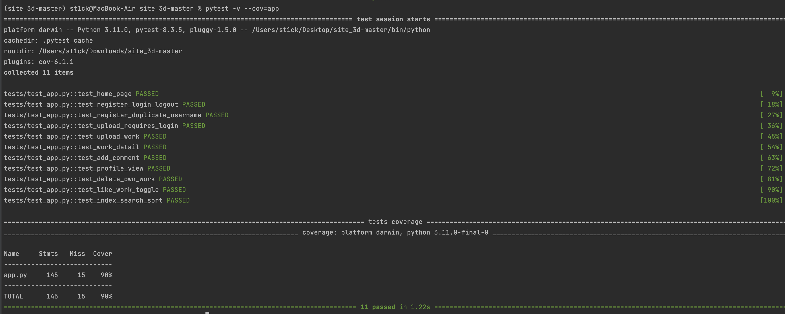

# 🧪 Документация по тестированию

## 🔧 Стратегия тестирования

**Цель:**  
Обеспечить стабильную, безопасную и предсказуемую работу пользовательских функций веб-приложения.

**Инструменты:**
- [`pytest`](https://docs.pytest.org/) — фреймворк для написания и запуска тестов.
- [`pytest-cov`](https://github.com/pytest-dev/pytest-cov) — плагин для анализа покрытия кода.
- Временная база данных SQLite для изолированного тестирования без влияния на продакшн-данные.

**Типы тестов:**
- Функциональные: тестирование пользовательских сценариев (регистрация, вход, загрузка работ).
- Тесты доступа: проверка защищённости маршрутов.
- Покрытие кода: анализ покрытия функций, условий и ошибок.

---

## 🧪 Тестовые сценарии

| Название теста                    | Описание                                                                 |
|----------------------------------|--------------------------------------------------------------------------|
| `test_home_page`                 | Проверка доступности главной страницы.                                   |
| `test_register_login_logout`     | Проверка регистрации, логина и выхода пользователя.                      |
| `test_register_duplicate_username`| Попытка повторной регистрации с тем же логином.                          |
| `test_upload_requires_login`     | Доступ к загрузке работ только после авторизации.                        |
| `test_upload_work`               | Загрузка новой работы авторизованным пользователем.                      |
| `test_work_detail`               | Проверка страницы с детальным описанием работы.                          |
| `test_add_comment`               | Добавление комментария к работе.                                         |
| `test_profile_view`              | Просмотр страницы профиля пользователя.                                  |
| `test_delete_own_work`           | Удаление своей загруженной работы.                                       |
| `test_like_work_toggle`          | Проверка функционала лайков (вкл/выкл).                                  |
| `test_index_search_sort`         | Проверка работы поиска и сортировки на главной странице.                 |

---

## ✅ Результаты

- Всего тестов: 11
- Успешно пройдено: 11
- Время: 1.22s
- Ошибок: 0

## 📊 Покрытие кода

| Файл     | Строк | Пропущено | Покрытие |
|----------|-------|-----------|----------|
| app.py   | 145   | 15        | 90%      |

- **Команда запуска:**
  ```bash
  pytest -v --cov=app

- **Скриншот отчета:**
